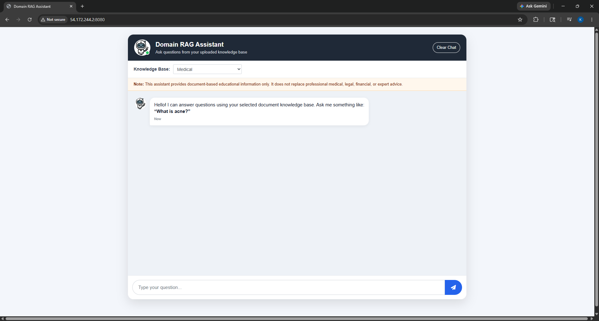
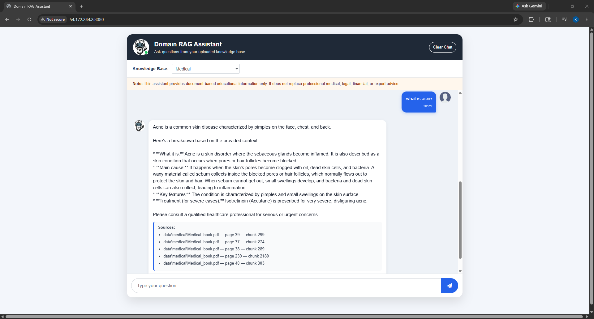
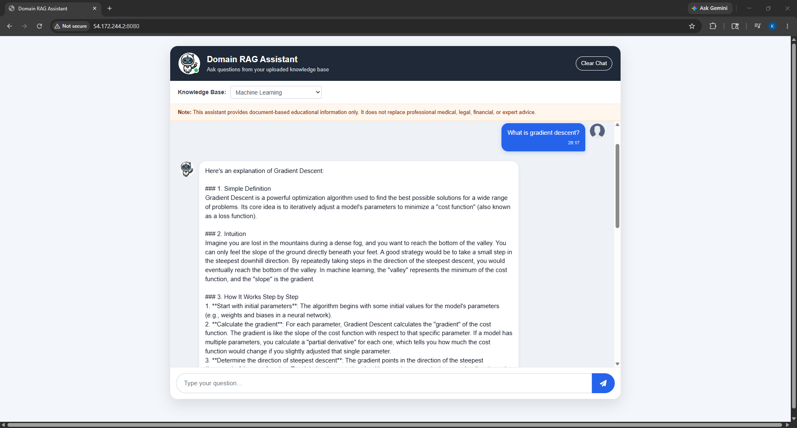
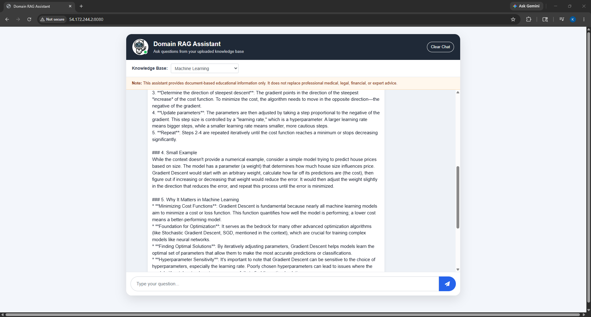
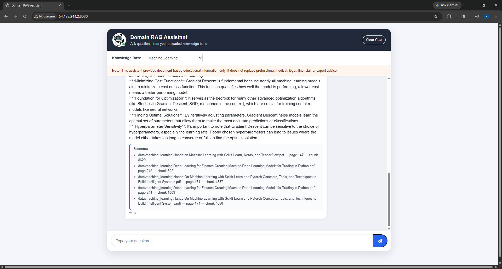
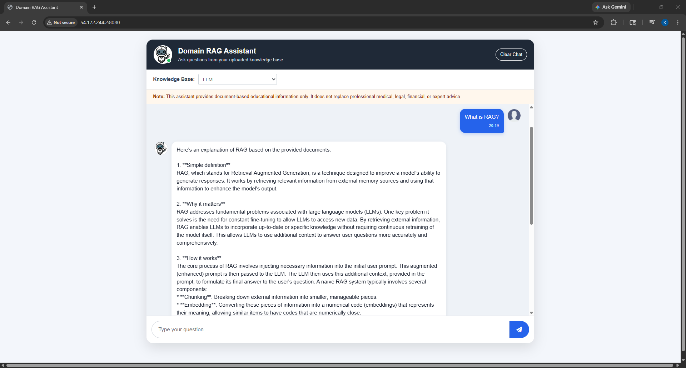
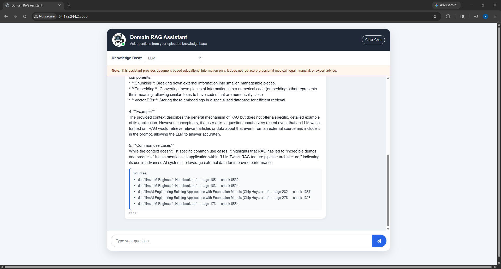

# Domain RAG Assistant

A multi-domain Retrieval-Augmented Generation (RAG) chatbot built using Flask, LangChain, Pinecone, Redis, and Gemini.

The assistant can answer questions from different knowledge bases such as:

- Medical
- Machine Learning
- Large Language Models (LLMs)

The system retrieves relevant document chunks from Pinecone vector storage and generates grounded answers using Gemini.

---

# Features

- Multi-domain RAG architecture
- Domain-based retrieval filtering
- Conversational memory with Redis
- Pinecone vector database
- LangChain retrieval pipeline
- Gemini-powered responses
- Dockerized deployment
- AWS EC2 deployment
- GitHub Actions CI/CD
- Clean responsive UI
- Conversation reset support
- Session-based chat memory

---

# Tech Stack

## Backend

- Python
- Flask
- LangChain
- Redis
- Pinecone
- Gemini API

## Embeddings

- HuggingFace `all-MiniLM-L6-v2`

## Deployment

- Docker
- AWS EC2
- Amazon ECR
- GitHub Actions

---

# System Architecture

```text
User Question
      ↓
Flask API
      ↓
LangChain Retrieval Chain
      ↓
Pinecone Vector Search
      ↓
Retrieve Relevant Chunks
      ↓
Gemini Generates Grounded Answer
      ↓
Redis Stores Conversation Memory
      ↓
Response Returned to User
```

---

# Project Structure

```text
domain-rag-assistant/
│
├── app.py
├── helper.py
├── store_index.py
├── requirements.txt
├── Dockerfile
│
├── templates/
│   └── chat.html
│
├── static/
│   ├── style.css
│   └── script.js
│
├── data/
│   ├── medical/
│   ├── machine_learning/
│   └── llm/
│
├── screenshots/
│   ├── homePage.png
│   ├── Medical-Question.png
│   ├── ML-Question.png
│   ├── ML-Question-2.png
│   ├── ML-Question-3.png
│   ├── LLM-Question1.png
│   └── LLM-Question2.png
│
└── .github/
    └── workflows/
        └── cicd.yml
```

---

# How It Works

## 1. Document Processing

PDFs are:

- Loaded
- Split into chunks
- Converted into embeddings
- Uploaded to Pinecone

Each chunk contains metadata:

```python
{
  "source": pdf_name,
  "page": page_number,
  "chunk_id": chunk_id,
  "domain": selected_domain
}
```

---

## 2. Domain-Based Retrieval

The chatbot retrieves only documents belonging to the selected domain.

Example:

```python
filter={"domain": "machine_learning"}
```

This prevents medical data from appearing in ML responses.

---

## 3. Redis Conversation Memory

Redis stores session-based conversation history.

Benefits:

- Remembers previous questions
- Supports conversational follow-ups
- Better user experience
- Faster than in-memory storage

---

# Screenshots

## Home Page



---

## Medical Domain Example



---

## Machine Learning Examples







---

## LLM Domain Examples





---

# Local Setup

## Clone Repository

```bash
git clone https://github.com/your-username/domain-rag-assistant.git
cd domain-rag-assistant
```

---

## Create Virtual Environment

```bash
python -m venv venv
```

### Windows

```bash
venv\Scripts\activate
```

### Linux/Mac

```bash
source venv/bin/activate
```

---

## Install Dependencies

```bash
pip install -r requirements.txt
```

---

## Environment Variables

Create a `.env` file:

```env
PINECONE_API_KEY=your_key
GOOGLE_API_KEY=your_key
GEMINI_API_KEY=your_key
FLASK_SECRET_KEY=your_secret
REDIS_URL=redis://localhost:6379/0
CHAT_SESSION_TTL=3600
```

---

# Run Locally

## Start Redis

```bash
docker run -d -p 6379:6379 redis
```

---

## Start Flask App

```bash
python app.py
```

Visit:

```text
http://127.0.0.1:8080
```

---

# Docker Setup

## Build Docker Image

```bash
docker build -t domain-rag-assistant .
```

---

## Run Container

```bash
docker run -d -p 8080:8080 domain-rag-assistant
```

---

# AWS Deployment

The project is deployed on AWS EC2 using:

- Docker
- Amazon ECR
- GitHub Actions CI/CD
- Self-hosted GitHub runner

---

# Live Demo

The project is live at: http://54.172.244.2:8080/

Note: The live demo depends on available Gemini API tokens — responses may pause when the free-tier token quota is exhausted.

# CI/CD Pipeline

The pipeline automatically:

1. Builds Docker image
2. Pushes image to Amazon ECR
3. Pulls latest image on EC2
4. Restarts Redis container
5. Deploys updated application container

---

# Redis Memory Workflow

- User conversations are stored in Redis
- Each browser session gets its own session ID
- Memory persists during refreshes
- Changing domains clears the current conversation context
- Redis runs inside Docker on the EC2 server

---

# Future Improvements

- Source citations with PDF pages
- Streaming responses
- User authentication
- Better UI/UX
- Vertex AI Gemini migration
- Cloud Run deployment
- Evaluation framework for RAG quality
- Semantic reranking
- Hybrid search
- Hosted production Redis

---

# Challenges Solved

- Multi-domain retrieval filtering
- Docker networking with Redis
- Redis memory integration
- Pinecone metadata filtering
- EC2 deployment automation
- GitHub Actions self-hosted runner setup
- Docker storage cleanup issues
- API key deployment synchronization

---

# Learning Outcomes

Through this project, I learned:

- Retrieval-Augmented Generation (RAG)
- Vector databases and embeddings
- LangChain pipelines
- Redis memory systems
- Docker containerization
- AWS deployment workflows
- CI/CD automation
- Production debugging
- Multi-domain AI systems

---

# Author

Kunal Pandey

GitHub: https://github.com/kpkp95
